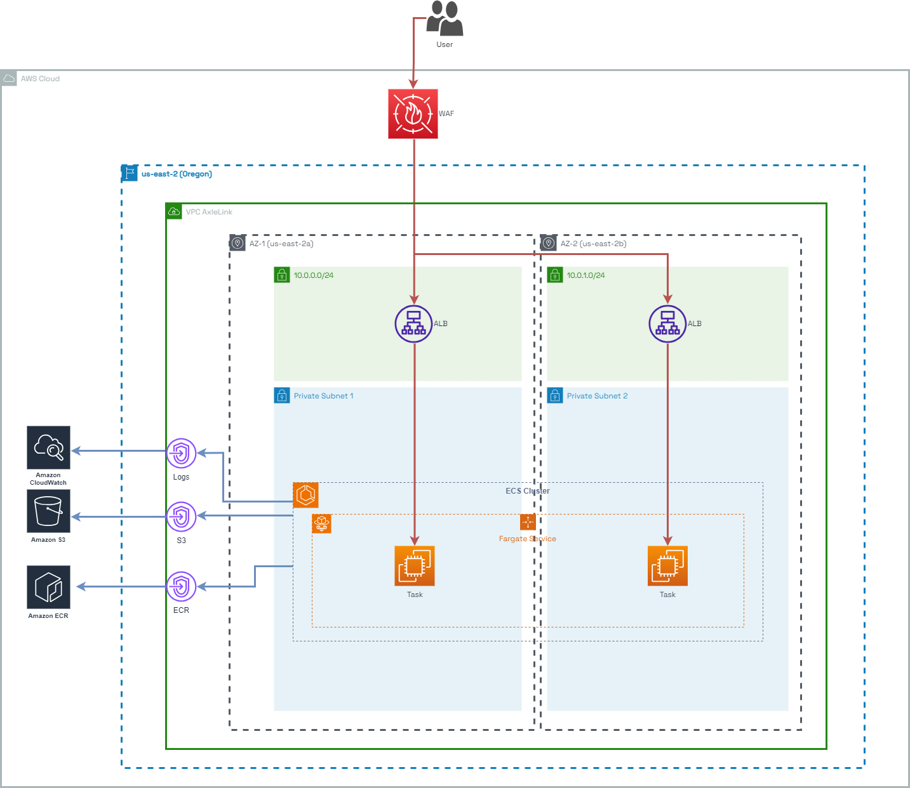
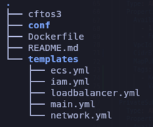

# Mock ECS Cloudformation template

This project was created as a technical test for the company Mozio to demonstrate expertise in DevOps, particularly AWS.

## Requirements

```
1. Application Description:
    - Use a simple web application for demonstration purposes.
    - Containerize the application using Docker.

2. Infrastructure Components:
    - Implement AWS ECS Fargate for container orchestration.
    - Set up an Application Load Balancer (ALB) for routing traffic to containers.

3. Networking and Security:
    - Use Amazon VPC for networking.
    - Implement private and public subnets for ECS Fargate and ALB.
    - Configure security groups to restrict traffic to and from the containers.
    - Implement network ACLs as needed for an additional layer of security.

4. High Availability:
    - Ensure high availability of the application by distributing containers across multiple Availability Zones.
    - Implement auto-scaling for ECS Fargate based on application load.

5. Deployment:
    - Use ECS service definitions to define tasks and services.
    - Implement a rolling deployment strategy to minimize downtime during updates.
    - Parameterize the CloudFormation template to allow customization for different environments.

6. Monitoring and Logging:
    - Implement basic logging for the application using AWS CloudWatch Logs.
    - Configure CloudWatch Alarms to monitor key performance metrics.

Deliverables:

1. CloudFormation Template:
    - Include all necessary AWS resources for the deployment.
    - Clearly document each resource and its purpose.
    - Parameterize aspects such as VPC CIDR, subnet configurations, container image, etc.
2. README Documentation:
    - Provide clear instructions on how to deploy the CloudFormation stack.
    - Include any prerequisites and steps for customization.
3. Demonstration:
    - Deploy the CloudFormation stack in a test environment.
    - Validate the application's functionality.
    - Provide any additional notes or considerations regarding the implementation.

Submission Instructions:
    - Create a GitHub repository.
    - Submit all your code;
    - Share the link with us.
```

## Introduction

 
 The project involves a CloudFormation template that deploys a containerized architecture using the [AWS ECS](https://katherineoelsner.com/) solution. An NGINX was used as the mock web application.

## Architecture



## Resources

### VPC

A VPC was deployed and configured with the following parameters:

| Parameter          | Value                                |
|--------------------|--------------------------------------|
| CIDR Block         | 10.0.0.0/16                          |
| Region             | Oregon (us-east-2)                   |
| Availability Zones | 'a' and 'b' (us-east-1a, us-east-1b) |
| Public Subnets     | 10.0.0.0/24, 10.0.1.0/24             |
| Private Subnets    | 10.0.2.0/24, 10.0.3.0/24             |

There are two Availability Zones (AZs) for high availability.
A route table was created for each type of subnets, one for the private and one for the public ones. For this architecture, there is no need to divide the private ones into separated route tables, because no NAT Gateways were deployed, as it is not necessary on this solution.

As there is no [NAT Gateway](https://docs.aws.amazon.com/vpc/latest/userguide/vpc-nat-gateway.html) deployed, any outbound communication within AWS resources must be kept inside the VPC. For this reason and also for security purposes, a [VPC endpoint](https://docs.aws.amazon.com/whitepapers/latest/aws-privatelink/what-are-vpc-endpoints.html) is deployed for the resources that have this needs. These are:

- ECR (which needs s3, ecr.dkr and ecr.api endpoints).
- Cloudwatch (which needs logs endpoint).

If there were outbound traffic, for testing environments there is the possibility to deploy an EC2 instance behaving as a NAT Gateway (NAT Instance), which avoids incurring unnecessary costs, as the NAT Gateway is not a low-cost resource.

### Application Load Balancer

The ALB was configured with a listener forwarding everything (*) to the target group to where the ECS Service is attached, and with a WAF in front of it.

### Application
For the application, an ECS Fargate Cluster was deployed with two replicas, one on each AZ. An ECR repository was also deployed for storing the images. In this way, they can be retrieved through the VPC Endpoint.
The ECS Service was also set with a Minimum Healthy Percent of 50% during updates, and a maximum of 200%. In this way, when an update is required, at least half of the tasks will be in RUNNING state during the update, while it is able to double the amount of tasks in RUNNING or PENDING state for avoiding downtime.
Also, an Application Auto-Scaling was configured in TargetTrackingScaling mode for increasing capacity when 75% of the CPU utilization is reached. For this resource, an IAM Role was created with the required permissions to monitor de cloudwatch alarms and perform the scaling.

### WAF

The AWS Web Application Firewall (WAF) is in charge of handling a list of rules for filtering non desirable network traffic against the endpoints. It sits in front of the Application Load Balancer and was configured with the following groups of rules:
- Baseline groups: AWS managed rule groups that provide a general protection against common threats. These are:
    - Core rule set: generally applicable to web application
    - Admin protection: block external access to exposed administrative page
    - Known bad inputs: block request patterns that are known to be invalid and are associated with exploitation or discovery of vulnerabilities
	For more information related to this groups, refer to [this document](https://docs.aws.amazon.com/waf/latest/developerguide/aws-managed-rule-groups-baseline.html)

- IP reputation list: blocks IP addressess typically associated with bots and other threats.
- Anonymous IP list: block requests from services that permit the obfuscation of viewer identity such as VPNs and proxies.

### Alarms

Some alarms were configured for monitoring key values:
- ALBLatencyAlarm: triggers when latency over 100s is detected.
- Http5xxAlarm and Http4xxAlarm: Looks for 5xx and 4xx response codes respectively within the last five minutes and triggers if it exceeds 10 responses.

In a further step, an SNS notification or some specific treatment could be built for managing the alarms triggered. 

## Deployment

Before executing the template, you must create the ECR repository, build and push the image. I recommend executing it inside a CloudShell in order to have visibility of the private ECR:

Login to the ECR.
```bash
 aws ecr get-login-password | docker login -u AWS \
 --password-stdin "https://$(aws sts get-caller-identity \
 --query 'Account' --output text).dkr.ecr.$(aws configure get region).amazonaws.com"
```

Clone the repository
```bash
 git clone https://github.com/tomimarson/mock-ecs-cloudformation.git
 cd mock-ecs-cloudformation
```

Build the image
```
 docker build . -t [repositoryUri]:[tag]
 docker push [repositoryUri]:[tag]
```

Once the image is pushed, the parameter "EcrRepositoryUri" must be filled inside conf/parameters-test.json file with the appropriate one. (e.g. 123456789012.dkr.ecr.us-east-2.amazonaws.com/test:1.0.0).
Lastly, execute the command for stack creation:
```
 aws cloudformation create-stack \
  --stack-name mozio-mock-cloudformation \
  --template-body file://./templates/main.yml \
  --parameters file://./conf/paremeters-test.json
```

Consider adding the "--profile" param if it is not being executed in a CloudShell.

## Important things to mention

As this project is a test of my skills and I currently cannot spend too much time on it, there are several things that I would implement in a real-world project but had to set aside on this test. Some of these are:

- Pipeline for IaC and for the Webapp.
- Scanning tools such as [checkov](https://checkov.io), [kics](https://github.com/Checkmarx/kics), [trivy](https://github.com/aquasecurity/trivy), among others. For the security tools, an implementation of [defect dojo](https://www.defectdojo.org/) for managing vulnerabilities is what I usually do.
- Ensure policies for Least Priveleges.
- Encryption at rest and in transit (Certificate Manager for HTTPS, KMS, Secret Manager...).
- Disable default SGs, ACLs, VPC.
- Follow a tagging convention for every AWS resource.
- Split the template into smaller and consistent parts and uploading them to an s3 bucket to reference them from a main file. The tree would look something like this:
 

Lastly, I would like to clarify that I generally do not use Cloudformation. I usually use Terraform for bigger projects. I find it to be a more comprehensive tool with greater modularity, granularity, reusability, more integrations and less bias. Additionally, It can be used for other cloud providers and for platform-level management.